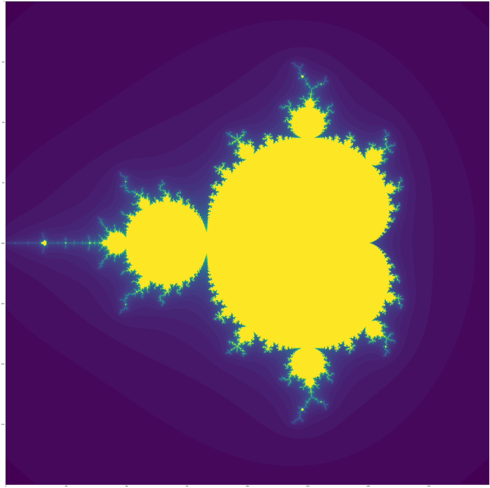

# Mandelbrotset-Zoomvideo
I wrote this code to animate the Mandelbrot-Set. I already developed a code to compute a still picture of the Mandelbrot-Set (you can find it at this link: https://github.com/LukasKretschmann/Mandelbrot-Set). At the end of the ```README.md``` there are two pictures from this algorithm. 

To run the algorithm to create one of these amazing Mandelbrot-Set Zoom-Videos just run the following python file: ```run.py```

There are multiple variables you can change to modify your video:  
-```MAX_FRAMES``` number of frames for the video  
-```MAX_ZOOM``` max zoom-factor for the video  
-```r_center, i_center``` these are the coordinates where the video will zoom into  
  My coordinates were: ```r_center, i_center = 0.340037926617566, -0.051446751669```  
-```fig_size``` size of the plot for the figure  
-```fig = plt.figure(
        figsize=(fig_size, fig_size), 
        dpi = 150,
        tight_layout=True
    )``` just change dpi if you want a higher resolution but you also have to change ```rpoints``` and ```ipoints``` right here: ```image = mandelbrot(rmin_, rmax_, 1000, imin_, imax_, 1000)```     
    -```writer = animation.FFMpegWriter(
        fps=2,
        metadata=dict(artist='Lukas Kretschmann'),
        bitrate = -1, 
        extra_args=['-pix_fmt', 'yuv420p'] 
    )``` just increase fps to get more frames per second     
    
The code will create an output file named ```OUTPUT.MP4``` and also an output folder named ```data```, where every individual frame is saved.  
    
    
And the whole code is available to dowload (```run.py```)





